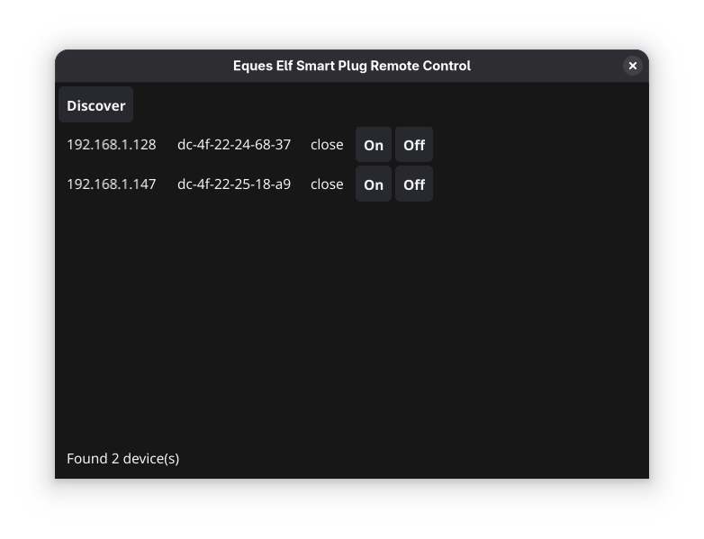

# eques-elf-go
Eques Elf Smart Plug remote control app in Go

The official Eques Elf Smart Plug app and their entire cloud service is gone. You can use this open source app instead to control them in a local network.

### See also

* <https://github.com/iamckn/eques>
* <https://github.com/lgo/eques-elf-python>
* <https://fcc.report/FCC-ID/2AA47-ELF/3730367.pdf>
* <https://play.google.com/store/apps/details?id=com.eques.plug&hl=en>
* <https://apps.apple.com/us/app/eques-elf/id1292283137>
* <https://github.com/HankJames/Vul-Reports/blob/main/FirmwareLeakage/com.eques.plug/com.eques.plug.md>
* <https://apkpure.net/eques-elf-smart-plug/com.eques.plug>
